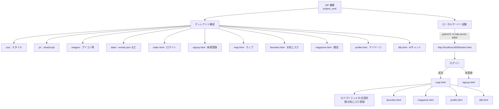
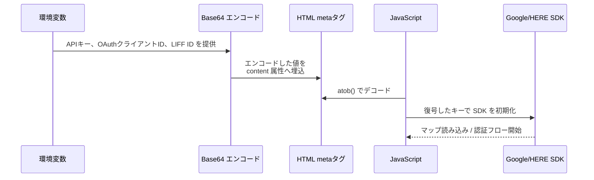
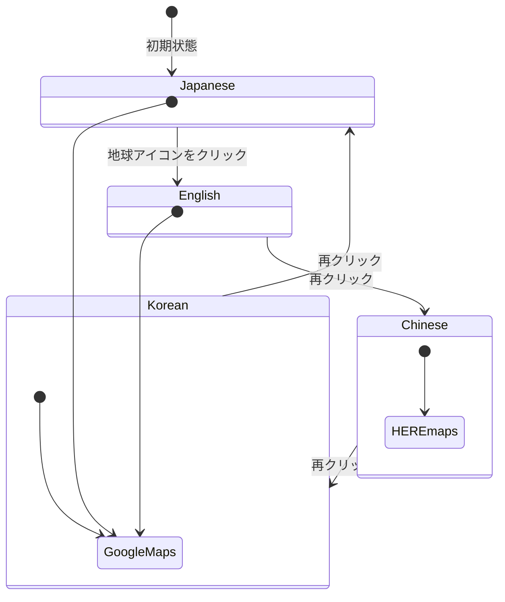
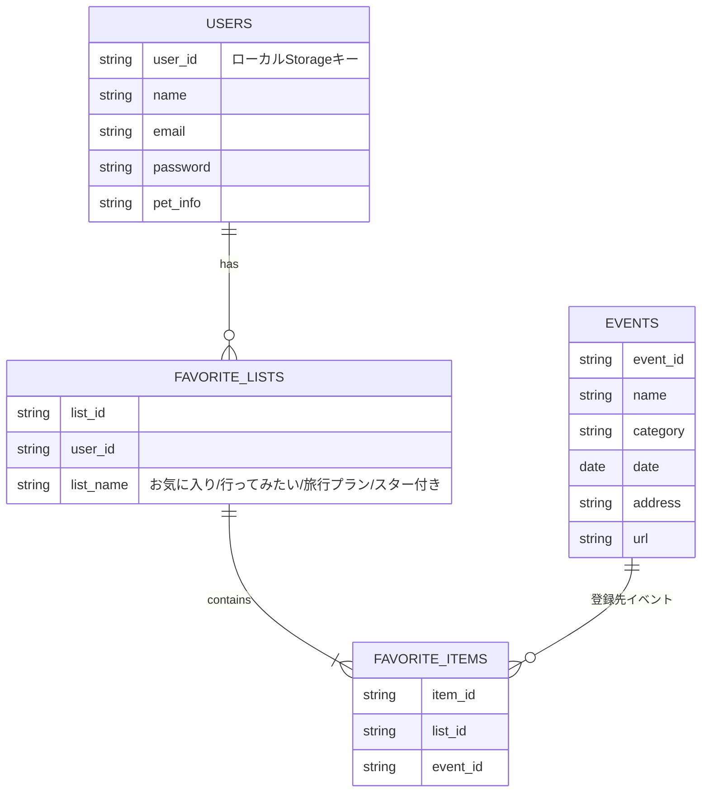

# Project RORO Web App Guide

このガイドは、プロジェクト RORO Web アプリの使い方と構築手順を図解したものです。セットアップからログイン、マップ表示、お気に入り管理、デプロイ方法まで、全体の流れをメインの視点から俯瞰できるようにまとめています。より詳細な内容は [sections](./sections) ディレクトリの各ファイルを参照してください。

## 全体像マインドマップ

```mermaid
mindmap
  root((Project RORO Web App))
    Setup & Keys
      "ローカルサーバー起動"
      "APIキーのBase64埋込"
    Authentication
      "新規登録/ログイン"
      "Google/LINE ソーシャルログイン"
    Map Features
      "言語切替 (日本語/英語/中国語/韓国語)"
      "カテゴリフィルタ (イベント/レストラン/ホテル/アクティビティ/美術館・博物館/施設)"
      "マーカー詳細とお気に入り登録"
      "ボトムナビ (マップ/AI/お気に入り/雑誌/マイページ)"
    Favorites & Magazine
      "お気に入り一覧"
      "月刊雑誌コンテンツ"
    Deployment
      "Windows セットアップ"
      "XServer への静的公開"
      "WordPress 連携"
```

## ファイル構成と操作フロー

以下のフローチャートは、ZIP 展開後のファイル構成とローカルサーバー起動、ユーザー操作の流れを表しています。



## APIキー注入シーケンス



## 言語切替ステート図



## お気に入り ER 図



各図は概要を示しており、実装の詳細はセクションごとに説明しています。
