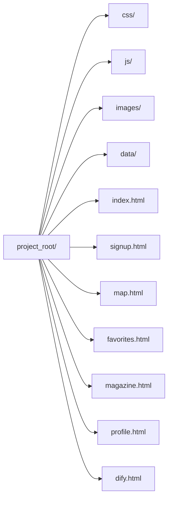

# セットアップとローカル起動

このセクションでは、プロジェクトのファイル配置とローカルでのサーバー起動方法について解説します。特別なバックエンドは不要で、静的ファイルを簡易HTTPサーバーで配信することで動作します。

## 準備するもの

- **Webサーバー環境**：Pythonの`http.server`モジュールで十分です。
- **ZIPファイル**：配布された`project_roro_webapp_final_updated19.zip`を展開します。

## ファイル構成

展開後のディレクトリ構造は次の通りです：



## サーバー起動手順

1. ターミナルで`project_root`ディレクトリに移動します。
2. 次のコマンドを実行します。

```
python3 -m http.server 8000
```

3. ブラウザで`http://localhost:8000/index.html`を開きます。以降のページ遷移は内部リンクから行えます。

