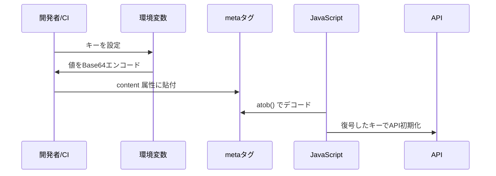

# APIキーとBase64注入

本アプリでは、Google Maps APIキー、HERE APIキー、Google OAuthクライアントID、LINE LIFF ID をHTMLファイル内の`meta`タグに埋め込みます。ただし生のキーを埋め込むと漏えいリスクがあるため、Base64エンコードした文字列を使用します。

## キーをBase64エンコードする

以下のように端末からエンコードします（Linux/Macの例）。

```
echo -n "YOUR_GOOGLE_MAPS_API_KEY" | base64
echo -n "YOUR_HERE_API_KEY" | base64
echo -n "YOUR_GOOGLE_OAUTH_CLIENT_ID" | base64
echo -n "YOUR_LINE_LIFF_ID" | base64
```

出力された文字列を`index.html`や`map.html`の`meta`タグに貼り付けます。

## metaタグの例

```html
<!-- API keys and OAuth identifiers -->
<meta name="google-oauth-client-id" content="(Base64 encoded Google OAuth Client ID)" />
<meta name="line-liff-id" content="(Base64 encoded LINE LIFF ID)" />
<meta name="google-maps-api-key" content="(Base64 encoded Google Maps API key)" />
<meta name="here-api-key" content="(Base64 encoded HERE API key)" />
```

## シーケンス図


