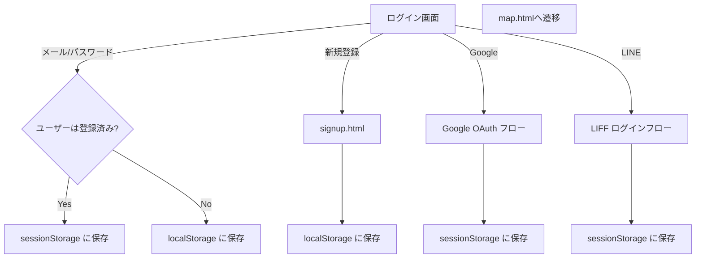

# 新規登録・ログイン・ソーシャルログイン

ユーザー認証はブラウザストレージを用いた簡易実装です。新規登録・通常ログイン・ソーシャルログインの３種類のフローを用意しています。

## 新規登録 (signup.html)

1. ログイン画面から「新規登録」リンクをクリックするか、`/signup.html`へ直接アクセスします。
2. 名前・メールアドレス・パスワード・ペット情報を入力し、「新規登録」を押します。
3. 入力内容は`localStorage`に保存され、ログイン状態でマップ画面へ遷移します。

## 通常ログイン (index.html)

1. 初期画面にて、登録済みのメールアドレスとパスワードを入力します。
2. 正しい組み合わせの場合は`sessionStorage`にセッション情報を保存し、`map.html`へリダイレクトします。
3. 登録が無いメールアドレスの場合は、その場で簡易ユーザーを生成しますが、ブラウザを閉じると情報は失われます。

## ソーシャルログイン

- **Googleログイン**：Google Identity Servicesを利用します。事前にGoogle Cloud ConsoleでOAuthクライアントIDを取得し、Base64で埋め込んでおく必要があります。ボタンを押すとgoogle.accounts.id.prompt() が呼び出され、ログイン後にメールアドレスと名前を`sessionStorage`に保存します。
- **LINEログイン**：LIFFアプリとして設定されたLINE Developersのチャネルを用います。Endpoint URLにアプリのドメインを登録し、取得したLIFF IDをBase64で埋め込みます。スマートフォンLINE内ブラウザでの利用が推奨されます。

