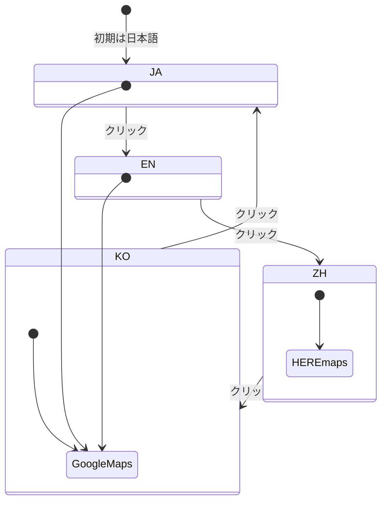

# マップ画面と言語切替

ログイン後に表示される`map.html`は、イベント検索とお気に入り登録の中心となる画面です。地図描画ライブラリとしてデフォルトでGoogle Mapsを使用しますが、言語が中国語モードに切り替わるとHEREのマップAPIに自動で切り替わります。

## 言語切替

- 画面右上の地球アイコンをクリックするたびに、**日本語→英語→中国語→韓国語**の順に循環します。
- 日本語・英語・韓国語モードではGoogle Mapsがロードされ、ラベルも自動翻訳されます。
- 中国語モードではHERE Location Servicesが使用されます。HERE APIキーをセットしておくと中国語表記のタイルが提供されます。

## カテゴリフィルタ

マップ上部には６種類のカテゴリボタンがあり、クリックで選択/解除ができます：

| アイコン | カテゴリ名 | 説明 |
|---|---|---|
| 🎪 | イベント | ペットイベントやフェスなど |
| 🍴 | レストラン | ペット同伴可の飲食店 |
| 🏨 | ホテル | ペットと泊まれる宿泊施設 |
| 🎠 | アクティビティ | ドッグランや遊戯施設 |
| 🏛️ | 美術館・博物館 | ペット関連の展示施設 |
| 🏢 | 施設 | 店舗・病院などその他施設 |

選択されたカテゴリのみが地図上に表示されます。

## マーカー詳細とお気に入り登録

- マーカーをクリックすると吹き出しが表示され、イベント名・日時・住所・外部リンクが表示されます。
- 「保存」ボタンを押すと、「お気に入り」「行ってみたい」「旅行プラン」「スター付き」のいずれかのリストに追加できます。重複登録は自動で防止します。

## 周辺表示ボタン

左下の「周辺表示 (Reset View)」ボタンを押すと、ユーザー登録時に入力した住所を中心に半径約20kmの範囲を再表示します。住所未設定の場合は東京駅が中心となります。

## ボトムナビゲーション

| アイコン | 機能 | 説明 |
|---|---|---|
| 🗺️ | マップ | 現在のマップ画面に戻る |
| 🤖 | AIアシスタント | `dify.html`でチャットUIを提供（モック） |
| ❤️ | お気に入り | 登録済みイベント一覧を表示 |
| 📖 | 雑誌 | 月刊デジタル雑誌コンテンツを表示 |
| 👤 | マイページ | ユーザー情報・ペット情報の確認と編集 |

